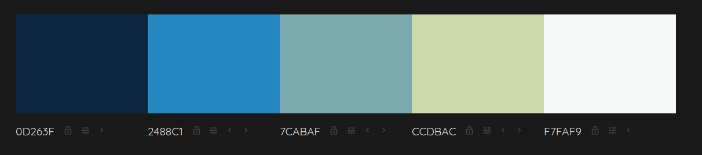
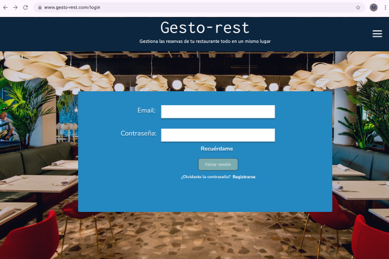
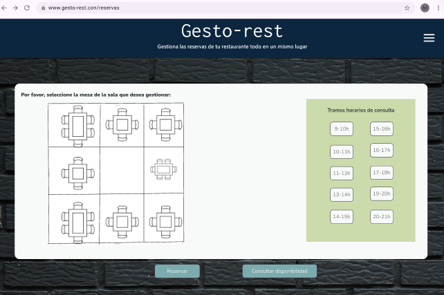
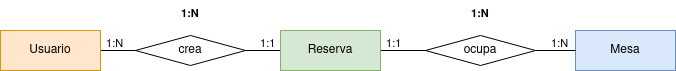

## Gestor de Reservas para restaurante

    

### Tarea para AED

Debe mostrarse las mesas y sus posibles ocupantes con CSS e imágenes. Ponemos un margen de dos horas para cada reserva. Esto es, si hay una reserva para las 15:00 no se admite otra reserva para esa mesa hasta las 17:00.

La app se puede acceder como usuario logueado y tiene capacidades para hacer reservas y/o modificarlas y/o anularlas.

Pensar habitualmente en reservas telefónicas que un empleado apunta/gestiona.

Del contacto telefónico que hace la reserva se guarda un nombre y un teléfono y el número de personas para la reserva.

Son los usuarios con rol admin los únicos que tienen permiso para registrar nuevos usuarios.  

Alumnas que realizan el trabajo: Noelia y Melissa

## Paleta de colores  

0D263F  
2488C1  
7CABAF  
CCDBAC  

## Mock up
_login_  

  
_reservas_  

## Modelo E-R  
  

## Índice

1.  [Anteproyecto](./anteproyecto)
2.  [Proyecto laravel](./gestor-restaurante)