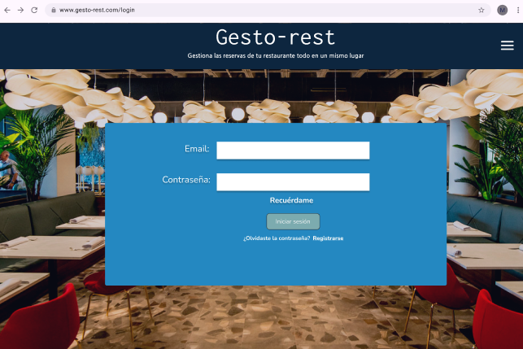

# Sistema de Reservas de Mesas

Este proyecto es una aplicación de gestión de reservas de mesas para un restaurante, construida en Laravel. Permite a los empleados y administradores realizar, modificar y cancelar reservas, asegurando que cada mesa tenga un margen de disponibilidad de dos horas entre reservas.

## Funcionalidades

### 1. Mesas y Reservas
- Cada **mesa** puede recibir reservas con un límite de dos horas entre cada una, es decir, si hay una reserva para una mesa a las 15:00, la siguiente reserva posible para esa mesa será a partir de las 17:00.
- **Reservas**: Cada reserva almacena información del cliente, incluyendo el nombre, teléfono, cantidad de personas, fecha y hora de la reserva.
- **Visualización de Mesas**: Las mesas se muestran en una cuadrícula en la interfaz de usuario. Cada mesa puede estar en uno de estos estados:
  - **Disponible**: Muestra una imagen de mesa disponible y permite crear una nueva reserva.
  - **Ocupada**: Muestra una imagen de mesa ocupada, indicando que la mesa tiene una reserva activa.
  
### 2. Roles de Usuario
- **Empleados** pueden:
  - Realizar nuevas reservas.
  - Modificar o cancelar reservas existentes.
- **Administradores** tienen permisos adicionales para:
  - Registrar nuevos usuarios en el sistema.
- El acceso a cada sección de la aplicación está restringido según el rol del usuario logueado.

## Estructura de la Base de Datos

### Modelo `Usuario`
- Almacena información de los usuarios del sistema, incluyendo su rol (empleado o administrador).

### Modelo `Mesa`
- Representa una mesa en el restaurante y almacena su capacidad y ubicación.

```php
Schema::create('mesas', function (Blueprint $table) {
    $table->id();
    $table->integer('capacidad');
    $table->string('ubicacion');
    $table->timestamps();
});
```

Hemos puesto la columna "ubicación" porque es útil para ubicar si es mesa de terraza, interior... Ya que hay restaurantes muy grandes que dividen las mesas por secciones.

### Modelo `Reserva`

Almacena los detalles de cada reserva:

- `mesa_id`: Relación con la mesa reservada.
- `user_id`: Relación con el usuario que gestionó la reserva.
- `nombre_cliente` y `telefono_cliente`: Datos de contacto del cliente.
- `num_comensales`: Número de personas en la reserva.
- `fecha_hora`: Fecha y hora de la reserva.


Schema::create('reservas', function (Blueprint $table) {
    $table->id();
    $table->foreignId('mesa_id')->constrained('mesas');
    $table->foreignId('user_id')->constrained('users');
    $table->string('nombre_cliente');
    $table->string('telefono_cliente');
    $table->integer('num_comensales');
    $table->dateTime('fecha_hora');
    $table->timestamps();
});

## Paleta de colores  


0D263F  
2488C1  
7CABAF  
CCDBAC  

## Mock up
_login_  

  
_reservas_  


## Modelo E-R  
  

